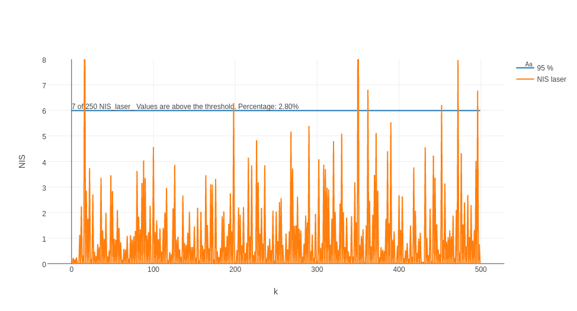
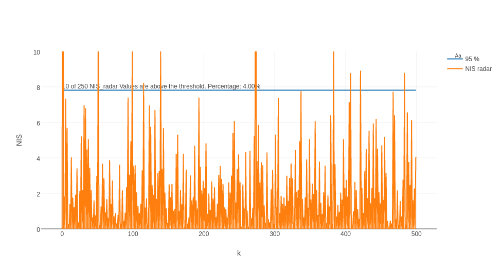
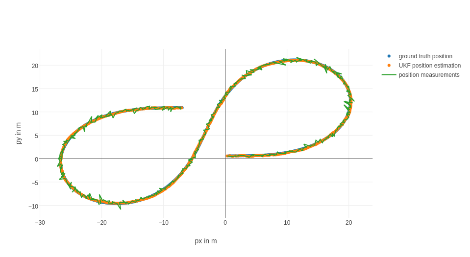
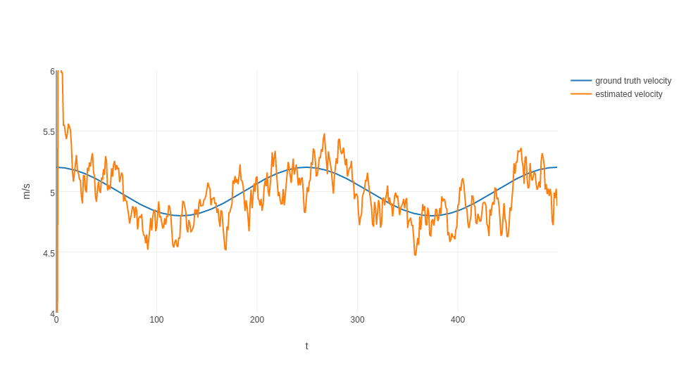
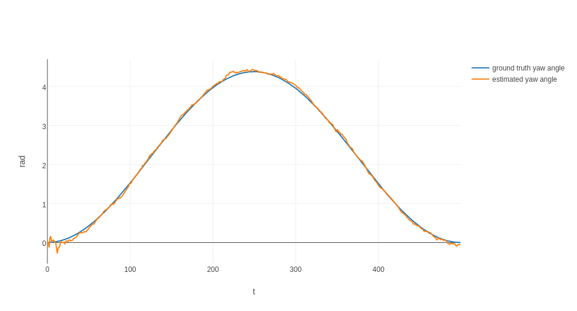
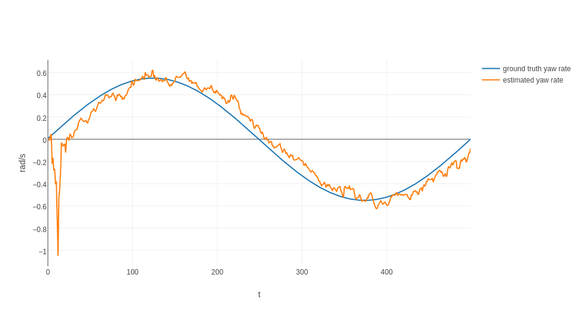

# Unscented Kalman Filter Project 
Self-Driving Car Engineer Nanodegree Program

In this project, I built an Unscented Kalman Filter in c++ to fuse sensor data from 2 sources:

- LIDAR Sensor
- RADAR Sensor

A constant turn rate and velocity magnitude (CTRV) model  is used to predict the states.

There are sample data files in the /data folder.

Run the UKF in a terminal entering:

./UnscentedKF /input/data/file /output/data/file

The following plots were made using the jupyter notebook ukf-visualisation-extended.ipynb (Taken from [here]( https://github.com/udacity/CarND-Mercedes-SF-Utilities ) and adjusted to my needs).

The process noise parameters std_a_ and std_yawdd_ were tuned using Normalized Innovation Squared (NIS) Values

The results are reasonable. See the RMSE Values in the table below.
 
Value   |                  RMSE      
----------------|-----------------------------------|                  
x  |      0.07 m        
y  |      0.08 m
vx |      0.34 m/s
vy |      0.23 m/s

The plots comparing ground truth and UKF estimations support the low RMSE values.

X vs Y Position:

Absolute velocity vs time:

Yaw angle vs time:

Yaw rate vs time:

